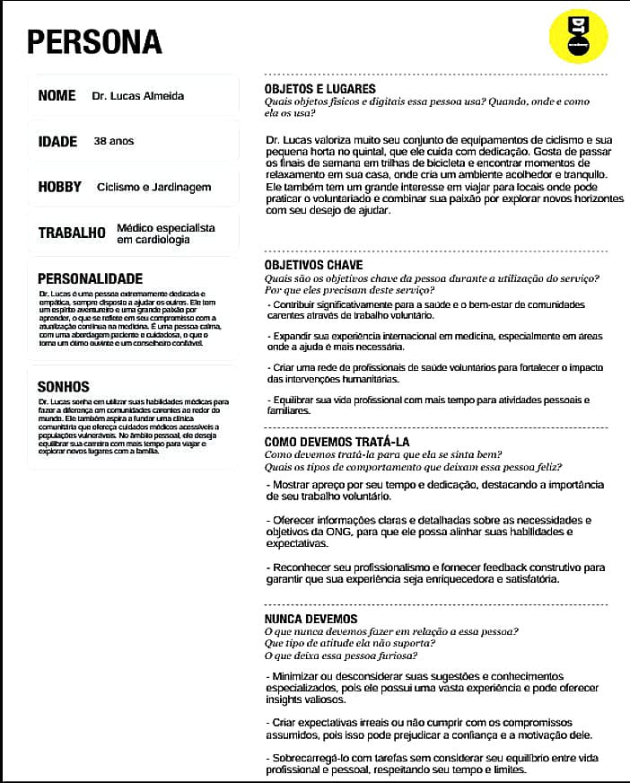
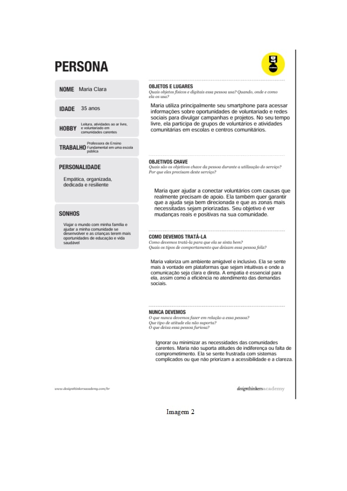
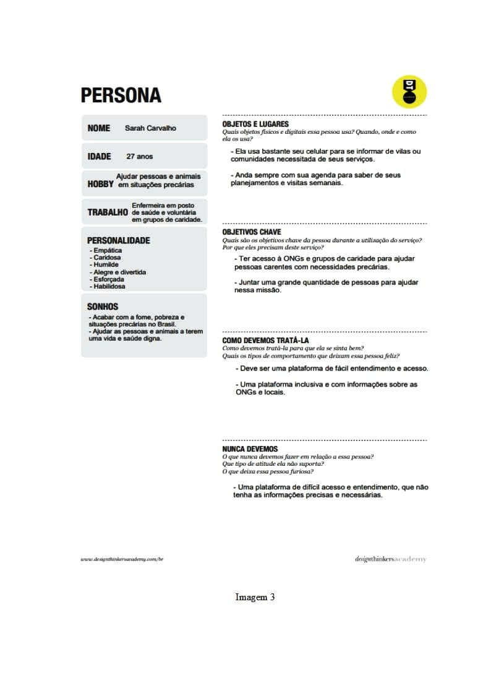

# Especificações do Projeto

Pré-requisitos: <a href="01-Documentação de Contexto.md"> Documentação de Contexto</a>

Definição do problema e ideia de solução a partir da perspectiva do usuário. É composta pela definição do  diagrama de personas, histórias de usuários, requisitos funcionais e não funcionais além das restrições do projeto.

## Personas

As personas levantadas durante o processo de entendimento do problema e busca do objetivo final do software são apresentadas nas figuras a seguir.

## Persona 1: Dr.Lucas Almeida

## Persona 2: Maria Clara

## Persona 3: Sarah Carvalho

## Histórias de Usuários

Com base na análise das personas forma identificadas as seguintes histórias de usuários:

|EU COMO... `PERSONA`| QUERO/PRECISO ... `FUNCIONALIDADE` |PARA ... `MOTIVO/VALOR`                 |
|--------------------|------------------------------------|----------------------------------------|
|Sarah Carvalho      | Deve aver informações sobre ONGs Locais | Pois tenho mobilidade reduzida e desejo contribuir com pessoas próximas a mim |
|Carla Oliveira      | Quero informações rápidas, que seja acessível e fácil de entender | Pois desejo me engajar em atividades voluntárias para ajudar minha comunidade |
|Lucas Almeida       | Informações claras e detalhadas sobre as necessidades e objetivos da ONG | Para me inscrever em oportunidades de  voluntariado e ajudar pessoas necessitadas na minha região |
|Maria Clara         | Quer ajudar a conectar voluntários com causas que realmente precisam de apoio | Para me engajar em atividades voluntárias para ajudar minha comunidade |
|João Pedro          | Quero um sistema que mapeie as zonas mais necessitadas | Para que eu possa direcionar os voluntários às áreas com maior demanda |
|José Algusto        | Quero encontrar pessoas dispostas a ajudar e ser voluntárias a minha ONG | Pois preciso de suporte com serviços essenciais, como alimentação e cuidados básicos |

## Requisitos

Para que haja um projeto bem estruturado e sólido é necessário requisitos a serem implementados, sendo eles, requisitos funcionais, que descrevem os aspectos que o sistema deve apresentar, de modo geral, para uma boa funcionalidade. Os requisitos são estes apresentados a seguir.

### Requisitos Funcionais

| ID     | Descrição do Requisito                                                                                                           | Prioridade |
|--------|----------------------------------------------------------------------------------------------------------------------------------|------------|
| RF-001 | Login/Criação de conta: Permitir que o usuário crie um login para acessar sua conta privada                                      | ALTA       |
| RF-002 | Preenchimento de dados para atendimento: O sistema permite que qualquer pessoa preencha um questionário para eventual atendimento | MÉDIA      |
| RF-003 | Chat de interação entre ONGs e Voluntários: Facilitar interação, coordenação ou parcerias para melhor atendimento ao público      | MÉDIA      |
| RF-004 | Serviços prestados pelos voluntários/ONGs: Exibir os serviços oferecidos e suas finalidades                                      | MÉDIA      |
| RF-005 | Sistema de matching: Se as condições do paciente atenderem os critérios de alguma ONG ou voluntário, ele poderá dar um match     | MÉDIA      |
| RF-006 | Agendamento de horários: Após o matching e verificação da disponibilidade de atendimento, o usuário poderá agendar o atendimento | MÉDIA      |
| RF-007 | Aceitação do atendimento: Após a solicitação, o usuário terá a opção de aceitar ou rejeitar o atendimento                        | MÉDIA      |
| RF-008 | Painel de controle para ONGs: ONGs podem gerenciar voluntários, blogs, atendimentos e tarefas                                    | MÉDIA      |
| RF-009 | Aba de doações: O sistema contará com uma seção exclusiva para doações                                                           | MÉDIA      |
| RF-010 | Aba blog: O sistema contará com uma seção exclusiva para conteúdo no formato de blog                                             | MÉDIA      |

### Requisitos Não Funcionais

| ID       | Descrição do Requisito                                                                                                       | Prioridade |
|----------|-------------------------------------------------------------------------------------------------------------------------------|------------|
| RNF-001  | O sistema contará com um mapa mostrando os pontos de atendimento                                                              | MÉDIA      |
| RNF-002  | Mapa de zonas com maior índice de atendimento: Exibir o foco das áreas que mais necessitam de atendimentos                    | MÉDIA      |
| RNF-003  | Sistema de notificações sobre consultas: ONGs e voluntários receberão notificações sobre pedidos de consulta                  | ALTA       |
| RNF-004  | Solicitação de atendimento: Após o agendamento, o responsável pelo atendimento receberá a solicitação                         | ALTA       |
| RNF-005  | Integração de calendário para agendamento: Após aceitar a consulta, o sistema salva a data e horário no calendário do profissional | ALTA |
| RNF-006  | Sistema de avaliação e feedback: Permitir que os usuários avaliem os serviços prestados                                       | MÉDIA      |
| RNF-007  | Integração com mapas para unidades de atendimento: Localizar facilmente os locais de atendimento                              | MÉDIA      |
| RNF-008  | Usabilidade: O sistema deve garantir uma interface intuitiva e fácil de usar, com navegação clara e processos simplificados   | ALTA       |
| RNF-009  | Segurança e privacidade: O sistema contará com criptografia para assegurar a segurança e privacidade dos usuários             | ALTA       |
| RNF-010  | O sistema deve ser responsivo para rodar em dispositivos móveis                                                               | MÉDIA      |
| RNF-011  | Deve processar requisições do usuário em no máximo 3 segundos                                                                 | BAIXA      |

### Restrições

O projeto está restrito pelos itens apresentados na tabela a seguir.

| ID  | Restrição                                                      |
|-----|----------------------------------------------------------------|
| 01  | O projeto deve ser concluído, obrigatoriamente, até 20 de dezembro de 2024 |
| 02  | Nenhum membro pode terceirizar o desenvolvimento do trabalho   |
