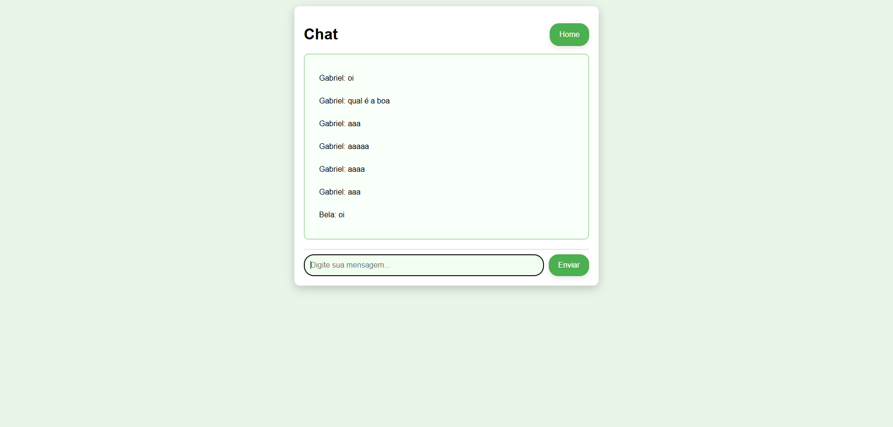

## 4. Projeto da Solução

Pré-requisitos: <a href="03-Modelagem do Processo de Negocio.md"> Modelagem do Processo de Negocio</a>

## 4.1. Arquitetura da solução

......  COLOQUE AQUI O SEU TEXTO E O DIAGRAMA DE ARQUITETURA .......

 Inclua um diagrama da solução e descreva os módulos e as tecnologias
 que fazem parte da solução. Discorra sobre o diagrama.
 
 **Exemplo do diagrama de Arquitetura**:
 
 
 

### 4.2. Protótipos de telas

Visão geral da interação do usuário pelas telas do sistema e protótipo interativo das telas com as funcionalidades que fazem parte do sistema (wireframes).
Apresente as principais interfaces da plataforma. Discuta como ela foi elaborada de forma a atender os requisitos funcionais, não funcionais e histórias de usuário abordados nas <a href="02-Especificação do Projeto.md"> Especificação do Projeto</a>.
A partir das atividades de usuário identificadas na seção anterior, elabore o protótipo de tela de cada uma delas.

São protótipos usados em design de interface para sugerir a estrutura de um site web e seu relacionamentos entre suas páginas. Um wireframe web é uma ilustração semelhante do layout de elementos fundamentais na interface.
 
> **Links Úteis**:
> - [Protótipos vs Wireframes](https://www.nngroup.com/videos/prototypes-vs-wireframes-ux-projects/)
> - [Ferramentas de Wireframes](https://rockcontent.com/blog/wireframes/)
> - [MarvelApp](https://marvelapp.com/developers/documentation/tutorials/)
> - [Figma](https://www.figma.com/)
> - [Adobe XD](https://www.adobe.com/br/products/xd.html#scroll)
> - [Axure](https://www.axure.com/edu) (Licença Educacional)
> - [InvisionApp](https://www.invisionapp.com/) (Licença Educacional)

## Diagrama de Classes

O diagrama de classes ilustra graficamente como será a estrutura do software, e como cada uma das classes da sua estrutura estarão interligadas. Essas classes servem de modelo para materializar os objetos que executarão na memória.

As referências abaixo irão auxiliá-lo na geração do artefato “Diagrama de Classes”.

> - [Diagramas de Classes - Documentação da IBM](https://www.ibm.com/docs/pt-br/rational-soft-arch/9.6.1?topic=diagrams-class)
> - [O que é um diagrama de classe UML? | Lucidchart](https://www.lucidchart.com/pages/pt/o-que-e-diagrama-de-classe-uml)

## Modelo ER

O Modelo ER representa através de um diagrama como as entidades (coisas, objetos) se relacionam entre si na aplicação interativa.]

As referências abaixo irão auxiliá-lo na geração do artefato “Modelo ER”.

> - [Como fazer um diagrama entidade relacionamento | Lucidchart](https://www.lucidchart.com/pages/pt/como-fazer-um-diagrama-entidade-relacionamento)

### 4.3. Modelo de dados

O desenvolvimento da solução proposta requer a existência de bases de dados que permitam efetuar os cadastros de dados e controles associados aos processos identificados, assim como recuperações.
Utilizando a notação do DER (Diagrama Entidade e Relacionamento), elaborem um modelo, na ferramenta visual indicada na disciplina, que contemple todas as entidades e atributos associados às atividades dos processos identificados. Deve ser gerado um único DER que suporte todos os processos escolhidos, visando, assim, uma base de dados integrada. O modelo deve contemplar, também, o controle de acesso de usuários (partes interessadas dos processos) de acordo com os papéis definidos nos modelos do processo de negócio.
_Apresente o modelo de dados por meio de um modelo relacional que contemple todos os conceitos e atributos apresentados na modelagem dos processos._

#### 4.3.1 Modelo ER

O Modelo ER representa através de um diagrama como as entidades (coisas, objetos) se relacionam entre si na aplicação interativa.]

As referências abaixo irão auxiliá-lo na geração do artefato “Modelo ER”.

#### 4.3.2 Esquema Relacional

O Esquema Relacional corresponde à representação dos dados em tabelas juntamente com as restrições de integridade e chave primária.
 
As referências abaixo irão auxiliá-lo na geração do artefato “Esquema Relacional”.

> - [Criando um modelo relacional - Documentação da IBM](https://www.ibm.com/docs/pt-br/cognos-analytics/10.2.2?topic=designer-creating-relational-model)

---

#### 4.3.3 Modelo Físico

Insira aqui o script de criação das tabelas do banco de dados.

Veja um exemplo:

<code>

 CREATE TABLE Voluntario (
    ID_Voluntario INT PRIMARY KEY,
    Nome VARCHAR,
    CPF INT,
    fk_Telefone_Telefone_PK VARCHAR,
    Endereco_ VARCHAR,
    CEP VARCHAR,
    Data_Nascimento_ DATE,
    E_mail VARCHAR,
    Senha VARCHAR,
    Profissao VARCHAR,
    Descricao_Pessoal_ VARCHAR,
    Formacao_Academica VARCHAR
);

CREATE TABLE ONG (
    ID_ONG INT PRIMARY KEY,
    Nome VARCHAR,
    CNPJ VARCHAR,
    Endreco VARCHAR,
    FK_Telefone_Telefone_PK VARCHAR,
    FK_Area_Atuacao_Area_Atuacao_PK VARCHAR,
    Historico VARCHAR,
    FK_Necessidades_Necessidades_PK VARCHAR,
    E_mail VARCHAR,
    Senha VARCHAR
);

CREATE TABLE Chat (
    ID_Chat INT,
    Mensagem VARCHAR,
    Data_Hora DATE
);

CREATE TABLE Match_Demonstra_Interesse (
    ID_Match INT PRIMARY KEY,
    Data_Match DATE,
    fk_Voluntario_ID_Voluntario INT,
    fk_ONG_ID_ONG INT
);

CREATE TABLE Telefone (
    Telefone_PK VARCHAR NOT NULL PRIMARY KEY,
    Telefone VARCHAR
);

CREATE TABLE Telefone (
    Telefone_PK VARCHAR NOT NULL PRIMARY KEY,
    Telefone VARCHAR
);

CREATE TABLE Area_Atuacao_ (
    Area_Atuacao__PK VARCHAR NOT NULL PRIMARY KEY,
    Area_Atuacao_ VARCHAR
);

CREATE TABLE Necessidades (
    Necessidades_PK VARCHAR NOT NULL PRIMARY KEY,
    Necessidades VARCHAR
);
 
ALTER TABLE Voluntario ADD CONSTRAINT FK_Voluntario_2
    FOREIGN KEY (fk_Telefone_Telefone_PK)
    REFERENCES Telefone (Telefone_PK)
    ON DELETE NO ACTION;
 
ALTER TABLE ONG ADD CONSTRAINT FK_ONG_2
    FOREIGN KEY (FK_Telefone_Telefone_PK)
    REFERENCES Telefone (Telefone_PK)
    ON DELETE NO ACTION;
 
ALTER TABLE ONG ADD CONSTRAINT FK_ONG_3
    FOREIGN KEY (FK_Area_Atuacao_Area_Atuacao_PK)
    REFERENCES Area_Atuacao_ (Area_Atuacao__PK)
    ON DELETE NO ACTION;
 
ALTER TABLE ONG ADD CONSTRAINT FK_ONG_4
    FOREIGN KEY (FK_Necessidades_Necessidades_PK)
    REFERENCES Necessidades (Necessidades_PK)
    ON DELETE NO ACTION;
 
ALTER TABLE Match_Demonstra_Interesse ADD CONSTRAINT FK_Match_Demonstra_Interesse_2
    FOREIGN KEY (fk_Voluntario_ID_Voluntario)
    REFERENCES Voluntario (ID_Voluntario);
 
ALTER TABLE Match_Demonstra_Interesse ADD CONSTRAINT FK_Match_Demonstra_Interesse_3
    FOREIGN KEY (fk_ONG_ID_ONG)
    REFERENCES ONG (ID_ONG);

</code>

Este script deverá ser incluído em um arquivo .sql na pasta src\bd.

### 4.4. Tecnologias

_Descreva qual(is) tecnologias você vai usar para resolver o seu problema, ou seja, implementar a sua solução. Liste todas as tecnologias envolvidas, linguagens a serem utilizadas, serviços web, frameworks, bibliotecas, IDEs de desenvolvimento, e ferramentas._

Apresente também uma figura explicando como as tecnologias estão relacionadas ou como uma interação do usuário com o sistema vai ser conduzida, por onde ela passa até retornar uma resposta ao usuário.

| **Dimensão**   | **Tecnologia**  |
| ---            | ---             |
| SGBD           | MySQL           |
| Front end      | HTML+CSS+JS+Bootstrap |
| Back end       | C# |
| Deploy         | Github Pages |
| IDE            | Visual Studio Code e Visual Studio |

