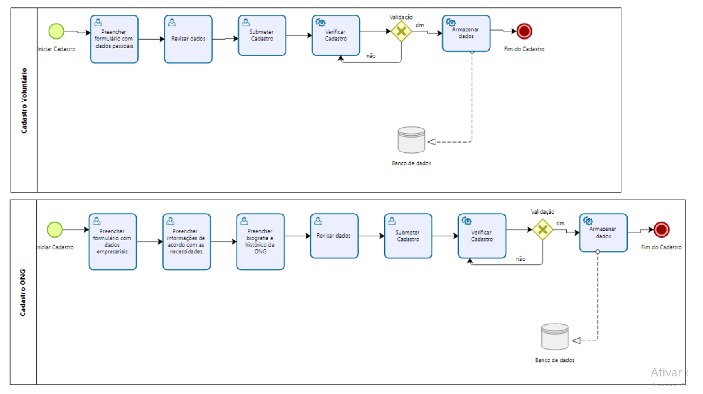

### 3.3.1 Processo 1 – CADASTRO E LOGIN DE ONGS E VOLUNTARIOS

Trata-se da tela de cadastro e login de ONGs e voluntários

#### Detalhamento das atividades

#### Para Voluntários:
Acesso ao Formulário de Cadastro: O voluntário clica em "Cadastrar-se" e é direcionado para o formulário de cadastro.
Preenchimento de Dados Pessoais: O voluntário insere suas informações pessoais (nome, telefone, endereço, data de nascimento, CPF, CEP, e-mail e senha).
Revisão e Confirmação: O voluntário revisa os dados e confirma o cadastro.
#### Para ONGs:
Acesso ao Formulário de Cadastro: A ONG clica em "Cadastrar-se" e é direcionada para o formulário de cadastro.
Preenchimento de Dados da ONG: A ONG insere informações.
Necessidades da ONG: A ONG fornece informações sobre os tipos de voluntários que busca.
Histórico da ONG: Um campo para um breve histórico explicando seu propósito e atividades.
Revisão e Confirmação: A ONG revisa os dados e confirma o cadastro.

_Os tipos de dados a serem utilizados são:_

_* **Caixa de texto** - campo texto de uma linha_

**Cadastro de Voluntários**

| **Campo**            | **Tipo**         | **Restrições**       | **Valor default** |
| Nome do voluntário   | Caixa de texto   | Máximo 30 caracteres | ---               |
| Telefone             | Numérico         | Máximo 12 caracteres | ---               |
| CPF                  | Numérico         | Máximo 14 caracteres | ---               |
| Registro do Conselho | Caixa de texto   | ---                  | ---               |
| Área de atuação      | Caixa de texto   | ---                  | ---               |
| Endereço             | Caixa de texto   | formato 100 caracter | ---               |
| Email                | Caixa de texto   | Formato de e-mail    | ---               |
| Senha                | Caixa de texto   | Mínimo 8 caracters   | ---               |

| **Comandos**         |  **Destino**                             | **Tipo**          |
| Cadastrar Voluntário | Enviar pop-up de confirmação de cadastro | Default           |
| Cancelar             | Retornar para tela de login              | Cancelar          |

**Cadastro de ONGs**

| **Campo**            | **Tipo**         | **Restrições**       | **Valor default** |
| Nome da ONG          | Caixa de texto   | Máximo 30 caracteres | ---               |
| Telefone             | Numérico         | Máximo 12 caracteres | ---               |
| CNPJ                 | Numérico         | Máximo 18 caracteres | ---               |
| Área de atuação      | Caixa de texto   | ---                  | ---               |
| Endereço             | Caixa de texto   | formato 100 caracter | ---               |
| Email                | Caixa de texto   | Formato de e-mail    | ---               |
| Senha                | Caixa de texto   | Mínimo 8 caracters   | ---               |

| **Comandos**         |  **Destino**                             | **Tipo**          |
| Cadastrar ONG        | Enviar pop-up de confirmação de cadastro | Default           |
| Cancelar             | Retornar para tela de login              | Cancelar          |
