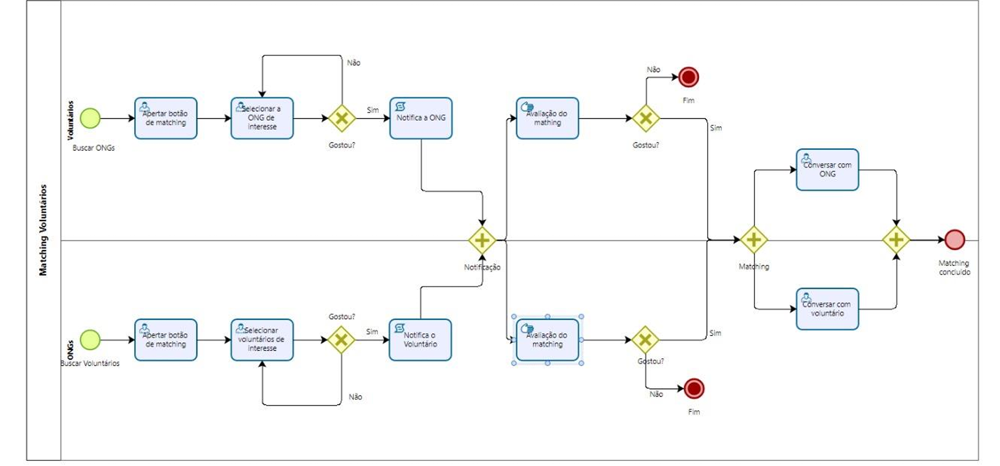

### 3.3.2 Processo 2 – NOME DO PROCESSO

Trata-se da tela de Match d ONGs e voluntários

#### Detalhamento das atividades

#### Para Voluntários:

Indicação de Interesse: O voluntário clica no ícone de coração para indicar interesse em uma ONG.
Notificação para a ONG: A ONG recebe uma notificação sobre o interesse do voluntário.
Ativação do Chat: Se a ONG aceitar o interesse, o chat é ativado para comunicação.
#### Para ONGs:
Indicação de interesse: A ONG clica em ícone de coração para indicar interesse em um voluntário.
Notificação para o Voluntário: O Voluntário recebe uma notificação sobre o interesse da ONG.
Ativação do Chat: Se o voluntário também der match, o chat é ativado para discutir a colaboração

_Os tipos de dados a serem utilizados são:_

_* **Área de texto** - campo texto de múltiplas linhas_

_* **Caixa de texto** - campo texto de uma linha_

**Acessar Plataforma**

| **Campo**       | **Tipo**         | **Restrições**         | **Valor default** |
| ---             | ---              | ---                    | ---               |
| Login           | Caixa de Texto   | Formato de e-mail      |                   |
| Senha           | Caixa de Texto   | Mínimo de 8 caracteres |                   |

**Matching**
| **Comandos**         |  **Destino**                            | **Tipo** |
| ---                  | ---                                     | ---      |
| Entrar               | Página pessoal                          | default  |
| Matching             | Página de Matching                      |          |
| Match                | Descrição da ONG/Voluntário  escolhido  |          |
| Aceitar/Recusar Match| Chat entre os conectados                |          |

**Dados Cadastrais**

| **Campo**              | **Tipo**         | **Restrições**        | **Valor default** |
| ---                    | ---              | ---                   | ---               |
| Nome                   | Caixa de texto   | Máx 60 caracteres     |                   |
| Descriçao              | Caixa de texto   | Máx 200 caracteres    |                   |
| Imagem                 | Imagem           | Jpg ou png            |                   |
| Endereco de atendimento| Caixa de texto   | Max 40 caracteres     |                   |
| Estado                 | Seleccao         | Somente 20 caracteres |                   |
| Cidade                 | Caixa de texto   | Máx 20 caracteres     |                   |

