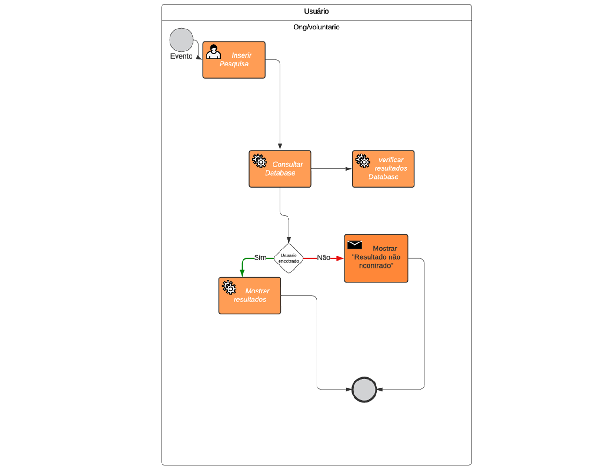

### 3.3.2 Processo 3 – PESQUISA DE INTERESSES ENTRE ONGS E VOLUNTARIOS

Trata-se da pesquisa de interesses entre ONGs e voluntários

#### Detalhamento das atividades

#### Para Voluntários
Acesso à Aba de Match: O sistema de match conecta o voluntário com a ONG de acordo com a base nas preferências e necessidades de cada um, facilitando o engajamento e a colaboração.
Visualização de ONGs: O voluntário visualiza uma lista de ONGs com descrições detalhadas (informações, descrições, imagens, etc).
#### Para ONGs:
Acesso à Aba de Match: O sistema de match conecta a ONG com o voluntário de acordo com a base nas preferências e necessidades de cada um, facilitando o engajamento e a colaboração.
Visualização de Voluntários: A ONG vê uma lista de voluntários que indicaram interesse em colaborar (informações, descrições, imagens, etc).

_Os tipos de dados a serem utilizados são:_

_* **Caixa de texto** - campo texto de uma linha_

**Pesquisar OGNs e Voluntários**

| **Campo**       | **Tipo**         | **Restrições** | **Valor default** |
| Pesquisar       | Caixa de Texto   | Máximo 30      | ---               |

| **Comandos**    |  **Destino**                                      | **Tipo** |
| Matching        | Encaminhar para página do catálogo de Voluntário  |  Default |
| Card Voluntários| Encaminhar para página de perfil de Voluntário    |  Default |

**Pesquisar Voluntários**

| **Campo**       | **Tipo**         | **Restrições** | **Valor default** |
| Pesquisar       | Caixa de Texto   | Máximo 30      | ---               |

| **Comandos**    |  **Destino**                                      | **Tipo** |
| Matching        | Encaminhar para página do catálogo de ONGs        |  Default |
| Card ONGs       | Encaminhar para página de perfil de ONGs          |  Default |